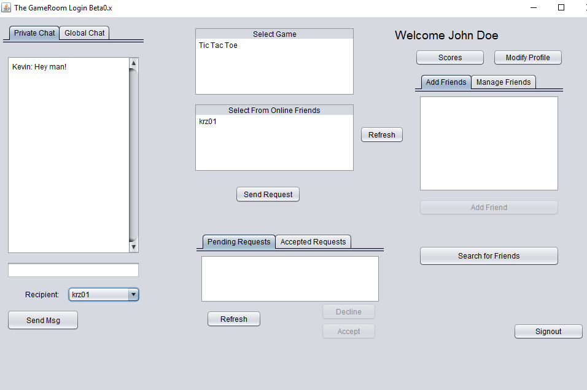
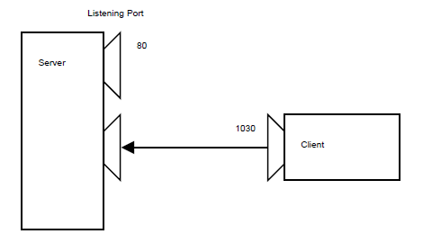
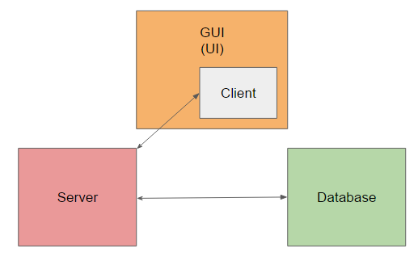

## The Game Room

This is an implementation of a "Steam-like" entertainment platform written entirely in Java. The **Game Room** provides the user with access to several multiplayer games through an online interface, where they can challenge their friends and play strategy games such as **Tic Tac Toe**.  

The Game Room is a project I worked on for my **Computer Networks** class. The objectives of this project were to become familiar with the Java programming language, get exposed to a *client-server* architecture, learn the basics of GUI design with Swing and gain experience with database design using mySQL.

  

## Files

    │---- src
    │     │---- client.java
    │     │---- gameRoom.java
    │     │---- server.java
    |     |---- sqlDB.java
    │
    |---- script.sql
    
`src` contains the 4 main files required for running **Game Room**. Run the sql script `script.sql` to create the tables necessary for the application in a database of your choice. Just make sure to update `sqlDB.java` with the correct database parameters (i.e. username, password) and edit `DB_URL` to reflect the correct name of your database.

## Implementation

The server part of the application is multithreaded. It runs on `localhost` and actively listens to connections on the port supplied by the command line. It consists of an `acceptClients()` method which loops in the background waiting for a client to connect. When one does, it forks a thread to accept the client in a thread of its own and instantiates a new socket for that client that listens on the same port. Note that the thread handling is asynchronously managed by use of an `ExecutorService`.

  

In each client handler, communication between client and server is done in the form of concatenated strings. The server identifies each command using an initial field we call **opcode**, inspired by the one used in assembly instructions.

Here are a few opcodes and their associated functions.

| Opcode        | Function      |
| ------------- | ------------- |
| 0             | Login         |
| 1             | Sign-Up       |
| 2             | Change Password|
| 3             | Get Messages For A Given User|
| 4             | Send A Chat Msg|
| 5             | Get All Registered Users|
| 6             |  Logout|
| 7             | Get All Global Chat|
| 8             | Get All Possible Friends|
| 9             | Add A Friend|

Once the opcode has been parsed, the server executes the command by using SQL queries provided by `sqlDB.java`. For example, to get a list of all registered users (opcode 5), the server makes use of the `sqlDB.getUsersDB()` method provided by the `sqlDB` class. Note that there are 8 mySQL tables that are used to store the information of the **Game Room** application.

  

## Features

- Login, Signup
- Change Password
- Play Tic Tac Toe
- Global Real-Time Chat
- Private Real-Time Chat
- Add, Remove Friends
- Accept, Decline Game Request
- View Hiscore and Ranking
- View Playing History

## Details for Running the Code

Command line arguments need to be specified before running the code. In Eclipse, this can be done by editing the **Arguments** tab in the Run Configuation window pane (Run > Run Configurations > Arguments).

- **Server Configuration**: just add the port number, for example 6066. Note that by default, it runs on localhost.
- **Client Configuration**: client requires server address and port number. Since server is localhost by default, add the following to the arguments tab: localhost 6066.
- **gameRoom GUI Configuration**: same as client.

Also, don't forget to edit `sqlDB` parameters as mentioned previously!

## Screenshots

Coming soon...

## References

- Multithreaded Server - click [here](http://stackoverflow.com/questions/12588476/multithreading-socket-communication-client-server)
- Tic Tac Toe - click [here](http://stackoverflow.com/questions/21806608/doing-tic-tac-toe-game-with-gui-interface-on-java-facing-runtime-error-after-in)
- Figure 2: Lecture 12, Comp 303, Programming Techniques - click [here](http://cs.mcgill.ca/~adenau/teaching/cs303/lecture12.pdf)

